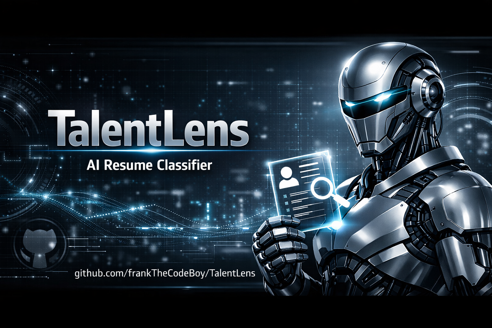

<!-- TalentLens GitHub Banner -->
<p align="center">
  
</p>
# 🧪 TalentLens - AI Resume Classifier

> ⚡ **Streamlit-native resume classification and analysis tool** deployed on Hugging Face Spaces.  
> 🎯 Single-port, production-ready application with full AI-powered analysis.

[](https://www.python.org/)
[](https://streamlit.io/)
[](https://huggingface.co/spaces/FrankOlum/TalentLens)
[](https://github.com/frankTheCodeBoy/TalentLens/actions)

---

## ✨ What is This?

**TalentLens** is a modern, automated resume intake, classification, and scoring application.  
It provides:

- 🔍 **Fast Classification** → Quick category prediction (Tech, Finance, Healthcare, Education, etc.)
- 🤖 **Deep AI Analysis** → Full extraction of skills, strengths, recommended roles, and a numerical match score
- 📜 **Persistent History** → All analyses stored locally in SQLite for audit & exploration

🌐 **Live Demo:** [TalentLens on Hugging Face Spaces](https://huggingface.co/spaces/FrankOlum/TalentLens)

---

## 🚀 Quick Start (Local Development)

### Prerequisites
- 🐍 Python 3.10+
- 📦 pip or uv package manager

### Installation
```bash
# Clone and setup
git clone https://github.com/frankTheCodeBoy/TalentLens.git
cd TalentLens
cp .env.example .env

# Add your Hugging Face API key to .env (optional, for AI summaries)
# HUGGINGFACE_API_KEY=hf_your_token_here

# Install dependencies
pip install -r requirements.txt

# Run the app
streamlit run app.py
```

The app will open in your browser at **http://localhost:8501**.

---

## 📱 Features
- 🗂️ **Tab 1: Fast Classification** → Upload PDFs, get instant category predictions, view charts  
- 🧠 **Tab 2: Deep AI Analysis** → Extract skills, strengths, roles, scores, and improvement tips  
- 📊 **Tab 3: History & Search** → Browse, filter, and audit past analyses with SQLite persistence  

---

## 🌍 Deployment
- 🐳 **Dockerfile included** → Hugging Face Spaces auto-builds and deploys  
- 🔑 **Secrets tab** → Add `HUGGINGFACE_API_KEY` for AI summaries  

---

## 📊 Tech Stack
- 🐍 Python (Streamlit, Pandas, Joblib)  
- 🤗 Hugging Face (Summarization API)  
- 🗄️ SQLite (Persistent history)  
- 📦 Docker (Spaces deployment)  

---

## 👨‍💻 Author
**Francis Olum (Frank)**  
Analytics Engineer & Open‑Source Advocate  

- 🌐 GitHub: [@frankTheCodeBoy](https://github.com/frankTheCodeBoy)  
- 🤗 Hugging Face Spaces: [TalentLens](https://huggingface.co/spaces/FrankOlum/TalentLens)

---

## ⭐ Contribute
- 🐛 [Report Issues](https://github.com/frankTheCodeBoy/TalentLens/issues)  
- 💬 [Join Discussions](https://github.com/frankTheCodeBoy/TalentLens/discussions)  
- ⭐ **Star this repo** to support the project and follow updates!  

---

## 📝 License
See LICENSE file for details.

---

❤️ Made with love by **Francis Olum**
